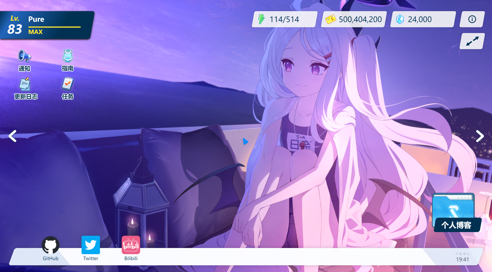
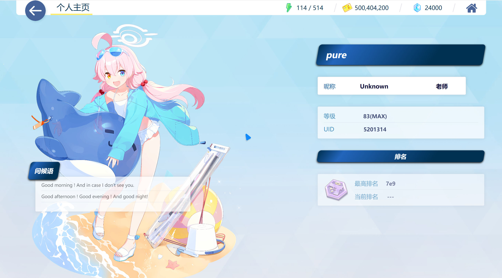

<h1 align="center">基于Blue Archive风格的个人主页</h1>


## 事先声明：我不是原作者！

#### 原作者：<a href="https://github.com/sf-yuzifu/homepage">小鱼yuzifu</a>

#### 页面设计参考作者：<a href="https://github.com/ApricotLemonTea/BA-style-homepage">杏仁レモンティー</a>


<h5 align="center">完成效果图</h5>






##### 预览链接：
<a href='https://homepage-pure.top/'>跳转链接</a>


##### 本地运行：

```
#推荐环境
node > 18.0.0  
npm > 8.15.0
```


##### L2D文件获取

游戏解包：<a href="https://www.bilibili.com/read/cv15934670/">教程</a>

注意：原作者的抓包方法已经不适用，因为目前pixi-spine不支持v4.2以上的spine动画


